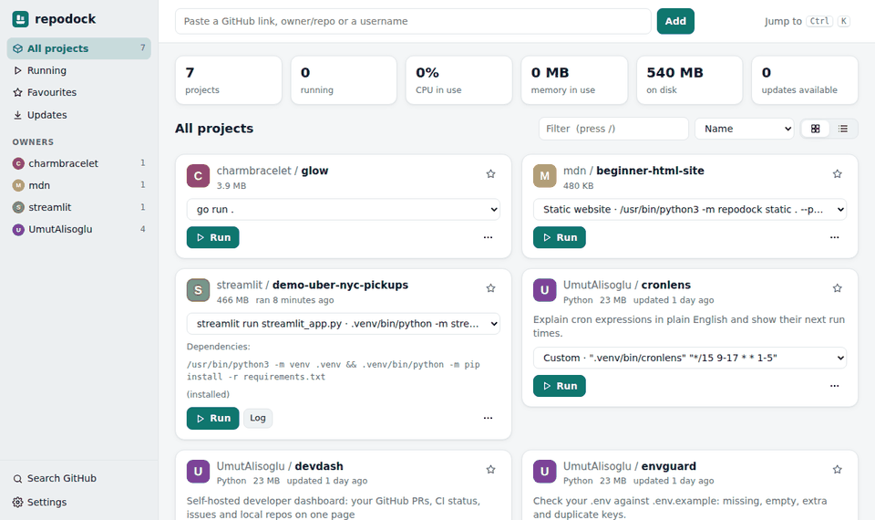
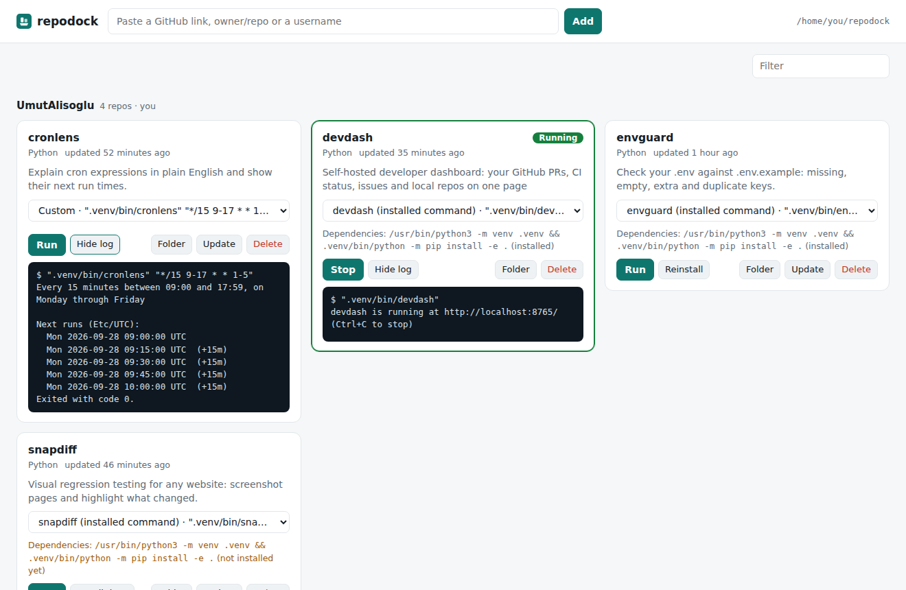
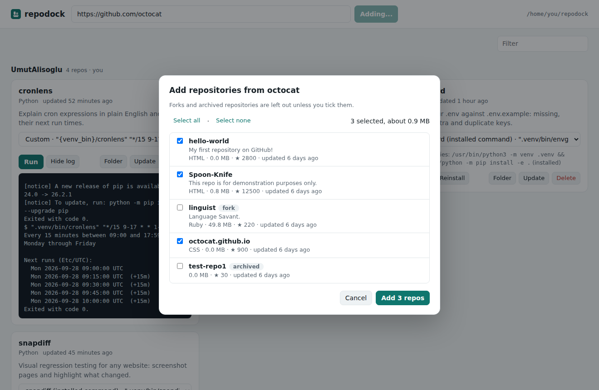

# repodock

**Paste a GitHub link, and repodock downloads the project and runs it from a local dashboard.**

Trying out a project from GitHub usually means cloning it, reading the README to
work out how to start it, installing its dependencies and keeping a terminal
open. repodock does that from one window: paste a link (or a username to pick
from all their repositories), and each project gets a card with its detected run
command, a Run/Stop button, live output with CPU and memory use, and buttons to
update, configure or delete it. It never installs or runs anything without
asking first. Works on Windows, macOS and Linux.



## What it does

- **Its own app window** on Windows (Edge WebView2), with a tray icon: closing
  the window keeps your apps running, and the tray menu stops them or quits.
  Starting repodock again brings the open window to the front. It can start
  with Windows, minimised to the tray.
- **Runs almost anything**: Node.js, Python, Go, Rust, .NET, Java, Docker,
  Makefiles, Windows programs and static websites (see the table below), or a
  ready-made program from the project's **GitHub Releases**. When a release has
  a download for your system, the card offers it, since that's usually quicker
  than building the project.
- **Terminal programs** (text interfaces like `glow`) can run in their own
  terminal window on Windows; the card suggests it when a program complains
  that it needs a terminal.
- **Live stats** per running app: CPU, memory (the whole process tree),
  uptime, and an **Open in browser** button as soon as the app prints a
  localhost address. **Stop all** in one click.
- **Per-project settings**: a fixed port, a `.env` editor (values hidden until
  you show them), and your own buttons like Build or Test.
- **Updates**: badges like "3 new commits" (checked with `git fetch` every 30
  minutes) and **Update all**.
- **Missing tools**: when a project needs Node.js, Python, Go, Rust, .NET,
  Java or Docker and it isn't installed, the card says so and offers the
  `winget` command to install it, which runs only when you confirm.
- **Crash notices** with optional auto-restart, and the **logs of the last
  five runs** of each project, searchable.
- **Disk use** per project and **Free up space**, which removes
  `node_modules`, `.venv` and ignored build output.
- **Your way**: light, dark or system theme, accent colour, cards or list,
  favourites, tags, owners with their avatars, and **GitHub search** inside the
  app.
- **Keyboard**: <kbd>Ctrl</kbd>+<kbd>K</kbd> jumps to any project
  (<kbd>Shift</kbd>+<kbd>Enter</kbd> runs it), <kbd>/</kbd> filters, <kbd>?</kbd>
  lists the rest.
- **Export and import** your library (projects, commands, tags and settings,
  not `.env` secrets) to move to another computer.



## Download for Windows

**[Download repodock-setup.exe](https://github.com/UmutAlisoglu/repodock/releases/latest/download/repodock-setup.exe)**,
double-click it and click through the installer. No Python or admin rights
needed. It adds repodock to the Start Menu (and the desktop, if you tick the
box) and can be removed from Windows Settings > Apps like any other program.

- Windows may say "Windows protected your PC" because the installer isn't
  signed. Click **More info**, then **Run anyway**.
- repodock opens in its own window. Closing it keeps repodock (and the apps
  you started) running in the tray, next to the clock; right-click the icon
  and choose **Quit repodock** to stop everything.
- Rather not install anything? Download
  [repodock-windows-portable.zip](https://github.com/UmutAlisoglu/repodock/releases/latest/download/repodock-windows-portable.zip),
  unzip it anywhere and double-click `repodock.exe`. `repodock-cli.exe` next
  to it is the command-line version.
- The window uses Microsoft Edge WebView2, which comes with Windows 10 and 11.
  If it's missing, repodock opens in your browser instead.
- repodock itself needs nothing else, but projects do: a Python project needs
  [Python](https://www.python.org/downloads/), a Node.js project needs
  [Node.js](https://nodejs.org/), and so on. The card tells you when something
  is missing. [Git](https://git-scm.com/downloads) is optional.

## Install with Scoop (Windows)

```powershell
scoop bucket add repodock https://github.com/UmutAlisoglu/repodock
scoop install repodock
```

That's the portable version: `repodock` in a terminal, and a Start Menu
shortcut for the app window. `scoop update repodock` gets new versions.

## Install with pipx (macOS, Linux, Windows)

```console
pipx install git+https://github.com/UmutAlisoglu/repodock
```

That's pure Python with no dependencies, and it opens the dashboard in your
browser. For the app window and tray icon, add the optional `app` extra, which
installs [pywebview](https://pywebview.flowrl.com/) (plus pystray and Pillow
for the tray icon on Windows):

```console
pipx install "repodock[app] @ git+https://github.com/UmutAlisoglu/repodock"
```

On macOS and Linux the window works when pywebview has a GUI backend (Cocoa,
or GTK/Qt); there's no tray icon there, so closing the window quits.

On Windows, install [Python](https://www.python.org/downloads/) first (tick
"Add python.exe to PATH"), then in PowerShell:

```powershell
py -m pip install --user pipx
py -m pipx ensurepath
pipx install git+https://github.com/UmutAlisoglu/repodock
```

[Git](https://git-scm.com/downloads) is recommended but optional: without it,
repodock downloads zip archives instead.

## Usage

```console
repodock
```

This opens the dashboard in its own window, or in the browser at
http://localhost:8766 (with `--browser`, or when the window isn't available).
Paste any of these into the box:

- `https://github.com/owner/project` (also `.git` links, `/tree/branch` links and `git@github.com:` links)
- `owner/project`
- `https://github.com/owner` or just `owner` to choose from all of their repositories



Projects are downloaded into `~/repodock/<owner>/<project>` and grouped by owner
on the page. Other commands:

```console
repodock --dir D:\Projects        # keep projects somewhere else (or set REPODOCK_DIR)
repodock --browser                # use the browser instead of the app window
repodock --minimized              # start in the tray
repodock --port 9000 --no-open
repodock add owner/project        # download from the terminal
repodock add owner --all          # every repository of a user, except forks and archived ones
repodock list
repodock detect path/to/folder    # show how repodock would run a folder
```

A GitHub token is optional. repodock uses `GITHUB_TOKEN`, `GH_TOKEN` or your
GitHub CLI login when present, which raises the API rate limit and lets it
recognize your own repositories.

## "Run with repodock" buttons

[](https://umutalisoglu.github.io/repodock/run/#UmutAlisoglu/repodock)

Links like `repodock://owner/project` open that project in repodock, which asks
whether to add it (nothing runs until you press Run). The Windows installer
sets this up; with pipx or the portable zip, turn on **Open "Run with repodock"
links** in Settings (Windows and Linux).

- **For your README:** make a button like the one above at
  [umutalisoglu.github.io/repodock](https://umutalisoglu.github.io/repodock/#badge).
  It links to a page that opens repodock, or explains how to get it.
- **Browser extension:** adds a Run with repodock button to every GitHub project,
  and a "Download for Windows" button on release pages that picks the right file
  for your computer. See [extension/](extension/).

## How it runs projects

repodock looks at the files in the project and suggests a run command. You can
pick another suggestion or type your own, and it's remembered per project.

| Project | Suggested command | Dependencies (asked first) |
|---|---|---|
| Node.js | `npm run dev`, `npm start`, or `node main.js` (pnpm, Yarn and Bun detected from the lockfile) | `npm install` / `npm ci` / `pnpm install` / ... |
| Python | the script the README says to run, `python main.py` (also `app.py`, `launch.py`, `webui.py`, ...), Django `manage.py runserver`, Flask, FastAPI (uvicorn), Streamlit, `python -m package`, or the project's own command from `pyproject.toml` | a `.venv` in the project, then `pip install -r requirements.txt` (or `requirements/dev.txt`, ...) and/or `pip install -e .` |
| Go | `go run .` or `go run ./cmd/<name>` | downloaded by Go |
| Rust | `cargo run --release` | downloaded by Cargo |
| .NET | `dotnet run --project <App>.csproj` | restored by dotnet |
| Java | `mvn spring-boot:run`, `mvnw`, `gradlew run` / `bootRun` | downloaded by the build tool |
| Deno | `deno task dev` / `start` | |
| Makefile | `make run` / `start` / `serve` / `dev` | |
| Procfile | the `web:` command | |
| Docker | `docker compose up --build` (first choice when it starts three or more services), or build and run the Dockerfile | |
| Start scripts | the project's own launcher first: `start_windows.bat`, `webui-user.bat`, `start.bat`, ... (`start_linux.sh`, `webui.sh`, `start.sh`, ... on macOS and Linux) | |
| Windows programs | a `.exe`, `.bat`, `.cmd` or `.ps1` in the project | |
| Static website | serves `index.html` (or `public/`, `docs/`, `dist/`) on a local port, or a list of folders when each one is its own small site | |

When a command needs a program you don't have (Node.js, Go, Docker, ...),
the card says so.

### Nothing runs without your say-so

- The first time you run a project, and whenever its command changes, repodock
  shows the exact command before anything runs. The same goes for your own
  command buttons, programs downloaded from Releases and `winget` installs.
- Dependencies are never installed automatically. If a project needs them,
  you choose between **Install and run**, **Run without installing** or
  **Cancel**, and you see the exact install command. Python dependencies go into
  a `.venv` inside the project, never into your system Python.
- Projects from other people get a clear warning: their code runs with your
  permissions, so only run what you trust.
- **Stop** ends the whole process tree (for example npm and the node server it
  started), on Windows too. Quitting repodock (tray menu, Settings, or Ctrl+C
  in a terminal) stops everything it started.
- The dashboard only listens on `127.0.0.1`. The API refuses requests from
  other websites (a custom header is required) and from other host names
  (which blocks DNS rebinding).

### Where things are kept

Projects go in `~/repodock/<owner>/<project>` (change it with `--dir` or
`REPODOCK_DIR`). repodock's own files are in `~/repodock/.repodock/`: the last
five logs of each project, downloaded releases, and `.repodock.json` next to
it holds your settings.

### Updating and deleting

**Update** runs `git pull`, or for zip downloads fetches the new version while
keeping installed dependencies. **Delete** stops the project and removes its
folder. Folders you clone into `~/repodock/<owner>/<project>` yourself show up
automatically.

## Development

```console
python -m venv .venv && source .venv/bin/activate
pip install -e .
python -m unittest discover -s tests
```

The tests use local git repositories and a fake GitHub API, so they need no
network. CI runs them on Linux (Python 3.9 to 3.13), Windows and macOS. The
Windows workflow builds `repodock.exe` and `repodock-cli.exe` with PyInstaller
(`packaging/windows/repodock.spec`), opens the app window and quits it, then
builds and silently installs the Inno Setup installer. Publishing a GitHub
release attaches the installer and the portable zip to it, updates the Scoop
manifest in `bucket/`, and saves winget manifests (made by
`packaging/manifests.py`) as a workflow artifact.

## License

MIT
